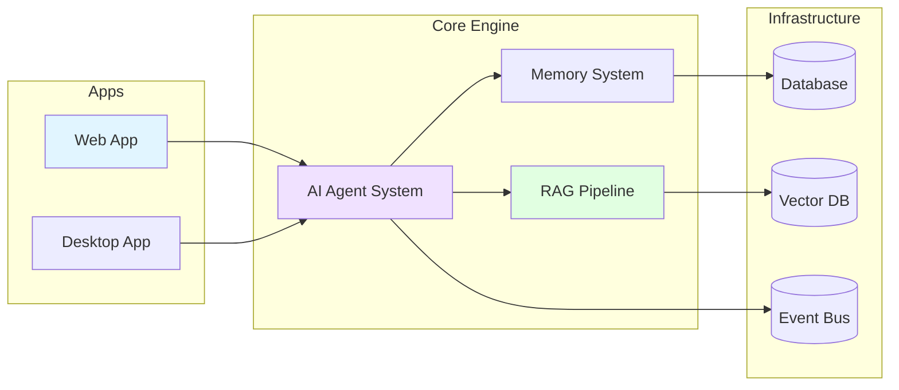

# Operone Platform - Project Proposal Presentation

**AI-Powered Desktop & Web Platform**

---

## 📊 Slide 1: Title & Overview

### Operone: Next-Generation AI Agent Platform

**Tagline:** *Intelligent. Autonomous. Integrated.*

**Project Type:** Full-Stack AI-Integrated Monorepo Platform  
**Version:** 0.1.0  
**Date:** November 2025

**Key Highlights:**
- 🌐 **Unified Platform**: Web & Desktop apps
- 🤖 **AI-First**: Built-in Agents & RAG
- 🔐 **Secure**: OAuth + Passkeys
- 📦 **Modular**: 5 Core Packages
- 🎯 **Modern**: 55+ UI Components

---

## 📊 Slide 2: Vision & Value Proposition

### The Problem & Solution

**The Challenge:**
Building AI applications is complex. Developers struggle with integrating LLMs, managing context (RAG), ensuring security, and delivering cross-platform experiences.

**The Operone Solution:**
A production-ready **AI Agent Platform** that provides the scaffolding for intelligent applications out of the box.

**Core Value:**
- **Speed to Market**: Pre-built AI engines and UI components.
- **Cross-Platform**: Write once, run on Web and Desktop.
- **Enterprise Ready**: Secure, scalable, and type-safe.

**Target Audience:**
- Developers building AI tools
- Teams needing autonomous automation
- Enterprises requiring secure AI assistants

---

## 📊 Slide 3: System Architecture

### High-Level Architecture

**Simplified Flow:**
1. **Apps** (Web/Desktop) send user requests to the **Core Engine**.
2. **AI Agents** process requests, utilizing **Memory** for context.
3. **RAG Pipeline** retrieves relevant data from the **Vector DB**.
4. **Event Bus** coordinates real-time updates across the system.

---

## 📊 Slide 4: Technology Stack

### Modern & Robust Foundation

**Frontend**
- **Frameworks**: Next.js 16 (Web), Electron 34 (Desktop)
- **UI**: React 19, Tailwind CSS, shadcn/ui
- **Language**: TypeScript 5.9

**Backend & Data**
- **Runtime**: Node.js
- **Databases**: MongoDB (App Data), PostgreSQL (Structured), Qdrant (Vector)
- **ORM**: Prisma
- **Events**: Redis

**AI & Integration**
- **SDK**: Vercel AI SDK
- **Models**: OpenAI, Anthropic, Google, Mistral
- **Protocol**: MCP (Model Context Protocol) for tool integration

---

## 📊 Slide 5: The Applications

### A Unified Experience

**1. Web Application**
- Full-stack Next.js app.
- User dashboard, settings, and cloud-based chat.
- Secure authentication and subscription management.

**2. Desktop Application**
- Native Electron app for macOS, Windows, Linux.
- **Deep Integration**: File system access, local tools.
- **Deep Linking**: Seamless login via web auth.

**3. Documentation Site**
- Comprehensive guides and API docs.
- Interactive component playground.

---

## 📊 Slide 6: AI & RAG Engine

### The Brain of Operone

**AI Agent System**
- **Autonomous Agents**: Can plan and execute multi-step tasks.
- **Tool Use**: File system, shell, and custom integrations.
- **Reasoning Loop**: "Think-Act-Observe" cycle for problem solving.

**RAG (Retrieval-Augmented Generation)**
- **Smart Context**: Fetches relevant documents to answer queries.
- **Hybrid Search**: Combines keyword and semantic search for accuracy.
- **Batch Processing**: Efficiently ingests and indexes large datasets.

---

## 📊 Slide 7: Core Systems: Memory & Events

### Intelligence & Real-Time Sync

**Memory System**
- **Short-Term**: Remembers the current conversation context.
- **Long-Term**: Stores user preferences and facts persistently.
- **Entity Extraction**: Automatically learns relationships from data.

**Event-Driven Architecture**
- **Real-Time**: UI updates instantly as agents think and act.
- **Decoupled**: Components communicate via events (Pub/Sub).
- **Observability**: Full tracing of agent actions and system state.

---

## 📊 Slide 8: Security & Authentication

### Enterprise-Grade Protection

**Authentication**
- **Multi-Method**: OAuth (Google, GitHub) & Passkeys (Biometric).
- **Session Management**: Secure, device-aware sessions.
- **Deep-Link Auth**: Securely logs in desktop app via browser.

**Security Layers**
- **Encryption**: API keys stored with AES-256 encryption.
- **Sandboxing**: Agents run with strict resource quotas.
- **Data Safety**: Input validation and SQL injection protection.

---

## 📊 Slide 9: Development Quality

### Built for Scale

**Monorepo Structure**
- **Efficiency**: Shared packages (UI, Logic, Types) across apps.
- **Tools**: Turborepo for fast, cached builds.

**Testing Strategy**
- **Unit Tests**: Vitest for logic and components.
- **E2E Tests**: Playwright for full user journeys.
- **Type Safety**: Strict TypeScript configuration.

**CI/CD**
- Automated linting, testing, and building on every commit.

---

## 📊 Slide 10: Deployment Strategy

### Ship Anywhere

**Web Deployment**
- **Vercel**: Optimized for Next.js, global edge network.
- **Scalable**: Serverless functions for backend logic.

**Desktop Distribution**
- **Builds**: Automated builds for macOS (.dmg), Windows (.exe), Linux.
- **Updates**: Over-the-air auto-updates.

**Infrastructure**
- **Docker**: Containerized services (DB, Redis, Vector Store) for easy setup.
- **Cloud Agnostic**: Can run on AWS, GCP, or on-premise.

---

## 📊 Slide 11: Roadmap

### Future Milestones

**Q1 2026: Foundation**
- ✅ Core Agent Engine & RAG
- ✅ Web & Desktop MVPs
- ✅ Basic Auth & Security

**Q2 2026: Expansion**
- ⏳ Voice Interface & Multi-modal support
- ⏳ Plugin System for 3rd party tools
- ⏳ Mobile Companion App

**Q3 2026: Enterprise**
- ⏳ SSO & Advanced Roles
- ⏳ On-Premise Deployment options
- ⏳ Collaborative Workspaces

---

## 📊 Slide 12: Team & Resources

### Required Capabilities

**Core Team Roles**
- **Lead Architect**: System design & AI integration.
- **Frontend Lead**: React/Next.js & UX excellence.
- **Backend/AI Engineer**: RAG pipeline & Agent logic.
- **DevOps**: Infrastructure & Security.

**Key Resources**
- **Development**: 6-month initial sprint.
- **Infrastructure**: Cloud hosting, Vector DB, LLM API credits.
- **Tools**: CI/CD pipelines, Testing frameworks.

---

## 📊 Slide 13: Budget & Timeline

### Investment Overview

**Estimated Budget (Year 1)**
- **Development**: $250,000 (Team & Tools)
- **Infrastructure**: $27,600 (Cloud & APIs)
- **Operations**: $100,000 (Maintenance & Support)
- **Total**: ~$377,600

**Timeline**
- **Month 1-2**: Architecture & Core Packages.
- **Month 3-4**: Web & Desktop App Development.
- **Month 5**: AI Integration & Testing.
- **Month 6**: Beta Launch & Deployment.

---

## 📊 Slide 14: Conclusion

### Ready to Build the Future

**Operone** is uniquely positioned to solve the complexity of building AI applications. By providing a unified, secure, and intelligent platform, we enable developers to focus on value, not infrastructure.

**Next Steps:**
1. Approve Proposal & Budget.
2. Initialize Development Team.
3. Begin Phase 1 Execution.

**Contact:**
- **Project Lead**: project-lead@operone.dev
- **Repository**: github.com/your-org/operone

*Operone: Intelligent. Autonomous. Integrated.*
